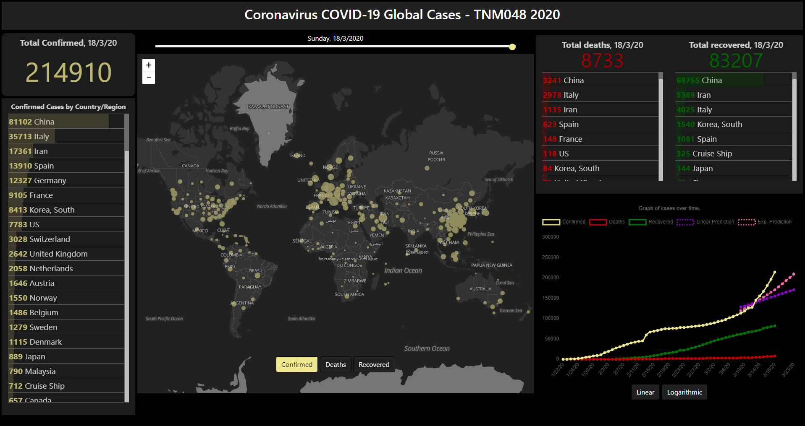
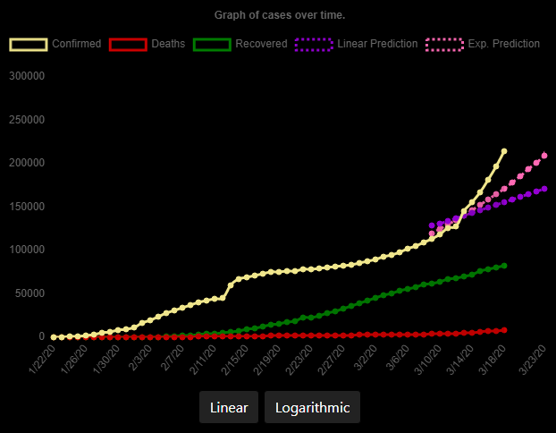

# COVID19-Visualization

This is a project from the Information Visualization course I took early 2020 during the first months of the pandemic. It was meant to imitate the [John Hopkins](https://gisanddata.maps.arcgis.com/apps/opsdashboard/index.html#/bda7594740fd40299423467b48e9ecf6) dashboard with an addition of a date slider which allows you to see the data for a specific date on the map.

The dashboard is built with [D3.JS](https://d3js.org/), [Chart.JS](https://www.chartjs.org/), [Leaflet](https://leafletjs.com/) and [Regression.JS](https://github.com/Tom-Alexander/regression-js).

Dataset used: [Novel Corona Virus 2019 Dataset](https://www.kaggle.com/sudalairajkumar/novel-corona-virus-2019-dataset)

The graph visualizes the data over time in a case-by-case basis and also contains the linear regression prediction for the 5 upcoming days. This is calculated from the last 10 days.

